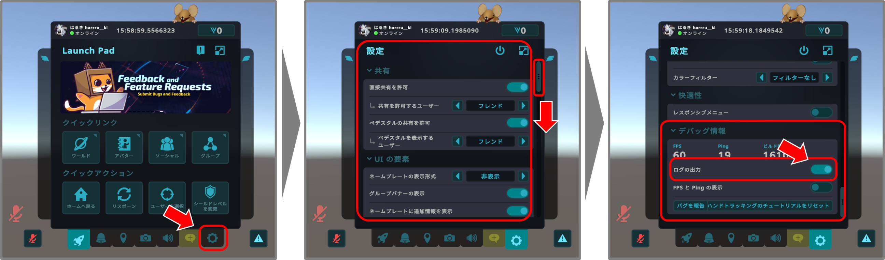

# TeamMaker_VRC_TMConquest

## これは何？

- このソフトウェアは、[**VRChat内で最大15人対15人のチーム戦が楽しめるVRサバイバルゲームワールド**(VirtualMarket9様制作、某エアガンメーカーT社様監修)](https://vrchat.com/home/world/wrld_0cc82f15-1d80-4a92-97a3-ffe1600b2766/info)での利用を想定した、**チーム分け支援ツール**です
  - **プレイヤーの一覧を取得**
  - **ランダムに2チームへ振り分け**
  - **結果をVRChat内のチャットボックスへ送信**  
  という流れで、チーム分けをサポートします
- このソフトウェアは **無料かつオープンソース** で配布されています

> このソフトウェアはいちユーザーによって開発されたものであり、**VRChat社、VirtualMarket9様、エアガンメーカーT社様は一切関係ありませんので、公式にご迷惑がかかりそうな事はご遠慮ください**

**動作環境**

- いわゆる**DesktopかPC VRのみ対応でQuest単機は非対応**です
- またOSはWindows 64bitのみ対応です

|VRChat動作環境|対応状況|
|:----|:---:|
|いわゆる`Desktop`(STEAM®, Windows 64bit, x86_64)|✅|
|いわゆる`Desktop`(STEAM®, 上記以外)|❌|
|いわゆる`PC VR`(STEAM VR®, Windows 64bit, x86_64)|✅|
|いわゆる`PC VR`(STEAM VR®, 上記以外)|❌|
|いわゆる`Quest単機`(Meta Quest/Google Play/PICO)|❌|

- VRChat API は不要です
  - .NETもインストール不要で動くはずです...（Windows 64bit, x86_64に.NET Native AOTビルド済み）
  - ただし、このソフトウェアのソートコードを改変/コンパイルされる方は.NET 9のインストールが必要です

**利用条件**

- MITライセンスのもとで配布します
- **無料ですが何の保証もサポートもできないです...**

## 使ってみよう！

**事前準備**

- VRChat内でデバッグログとOSCを有効にします
  - デバッグログは、`メニュー`→`設定`→`デバッグ情報`→`ログの出力`のトグルスイッチで有効にできます
    - 
  - OSCは、`アクションメニュー`→`オプション`→`OSC`→`有効`のトグルスイッチで有効にできます  
    - 

**使い方**

- **Step 1: ゲームワールドにJoin**
  - VRChatの[**某エアガンメーカーT社様監修のVRサバイバルゲームワールド**](https://vrchat.com/home/world/wrld_0cc82f15-1d80-4a92-97a3-ffe1600b2766/info)のインスタンスにJoinします
    - 他の人が立てたインスタンスでも構いません(InstanceOwnerやMasterである必要はありません)
    - チーム分けに参加したいプレイヤー全員が同じインスタンスにいる必要があります

- **Step 2: exeファイルを起動**

  - [リリースページ](https://github.com/harrru-ki/TeamMaker_VRC_TMConquest/releases/tag/v0.1.1)から `TeamMaker_VRC_TMConquest.exe` をダウンロードします  
    
  - ダブルクリックして実行します  
    
  - Microsoft Defender の警告が出る場合：  
     `詳細情報`→`実行`をクリックします
    

- **Step 3: 見学プレイヤーの選択**
  - 見学プレイヤー(チーム分けから除外するプレイヤー)の番号を入力後、`Enter`を入力します
      - 例えば`[4] はるき harrru__ki`を見学プレイヤーに追加したい場合は`4`と`Enter`を入力すると、見学プレイヤーの欄に`[7] はるき harrru__ki`が追加されます
      - 
  - 同じ手順で、見学プレイヤーを更に追加します
      - 例えば`[2] チャーリー`も見学プレイヤーに追加したい場合は`2`と`Enter`を入力すると、見学プレイヤーの欄に`[7] チャーリー`が追加されます
      - 
  - 逆に、見学プレイヤーから削除したい場合は見学プレイヤーの欄の番号を入力後、`Enter`を入力します
      - 例えば`[7] チャーリー`を見学プレイヤーから削除したい場合は`7`と`Enter`を入力すると、見学プレイヤーの欄から`[7] チャーリー`が削除されます
      - 
  - 見学プレイヤーの選択が完了したら、番号を入力せず`Enter`だけを入力します
      - 
  
- **Step 4: チーム分け結果をChatBoxに送信**
  - 下記のような画面に切り替わります
  - 既にチーム分けが実行され、結果がVRChatのChatBoxに送信されている状態です
  - ChatBoxに表示されているチーム分け結果を、インスタンス内の他のプレイヤーに確認してもらいチームにエントリーするなどの操作を行ってもらいます(この操作は各々のプレイヤー自身でやっていただく必要があります)
    - 
- **Step 5: exeファイルを終了**
  - 何らかのキーを入力するとexeファイルが終了します
  - 終了し忘れるとChatBoxが出たままになり、**位置バレするので注意しましょう！**
    - 

## Acknowledgment
- このソフトウェアは、
  - ChanyaVRC様のVRCOscLib(https://github.com/ChanyaVRC/VRCOscLib)
  - Microsoftのdotnet(https://github.com/dotnet/dotnet)  
  を使わせていただいております！感謝🙏
- このREADMEの作成に
  - かなリぁ様のオリジナル3Dモデル ハオランくん(https://booth.pm/ja/items/3818504)  
  を使わせていただいております！感謝🙏
